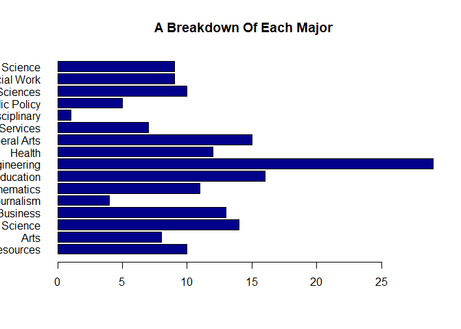

### Questions
####1.	 GitHub Cloning (20 points): Using Git, clone the following GitHub repository to your local machine: https://github.com/caesar0301/awesome-public-datasets.  In RMarkdown, please show the code (commented out, as it's not R syntax) that you used to create a new directory, navigate to the appropriate directory, and clone the repository to it.  One Git command per line, please.

   1. mkdir awesome-public-datasets
   2. cd awesome-public-datasets
   3. git clone https://github.com/awesomedata/awesome-public-datasets.git

####2.	Data Summary (20 points): From this aforementioned cloned repo, please extract titanic.csv.zip.  To be clear, this  does not have to be done in Git or command line.
   a. In R, please read in titanic.csv via either read.table() or read.csv(), assigning it to df. This dataset follows the passengers aboard the Titanic, including their fees paid, rooms rented, and survivorship status.

```r
library(readr)
library(ggplot2)
library(plyr)
library(tidyr)
library(forcats)
#read in titanic.csv
titanic <- read_csv("awesome-public-datasets/Datasets/titanic.csv")
```

```
## Parsed with column specification:
## cols(
##   PassengerId = col_integer(),
##   Survived = col_integer(),
##   Pclass = col_integer(),
##   Name = col_character(),
##   Sex = col_character(),
##   Age = col_double(),
##   SibSp = col_integer(),
##   Parch = col_integer(),
##   Ticket = col_character(),
##   Fare = col_double(),
##   Cabin = col_character(),
##   Embarked = col_character()
## )
```

```r
#Print up a summery of the titanic data
summary(titanic)
```

```
##   PassengerId       Survived          Pclass          Name          
##  Min.   :  1.0   Min.   :0.0000   Min.   :1.000   Length:891        
##  1st Qu.:223.5   1st Qu.:0.0000   1st Qu.:2.000   Class :character  
##  Median :446.0   Median :0.0000   Median :3.000   Mode  :character  
##  Mean   :446.0   Mean   :0.3838   Mean   :2.309                     
##  3rd Qu.:668.5   3rd Qu.:1.0000   3rd Qu.:3.000                     
##  Max.   :891.0   Max.   :1.0000   Max.   :3.000                     
##                                                                     
##      Sex                 Age            SibSp           Parch       
##  Length:891         Min.   : 0.42   Min.   :0.000   Min.   :0.0000  
##  Class :character   1st Qu.:20.12   1st Qu.:0.000   1st Qu.:0.0000  
##  Mode  :character   Median :28.00   Median :0.000   Median :0.0000  
##                     Mean   :29.70   Mean   :0.523   Mean   :0.3816  
##                     3rd Qu.:38.00   3rd Qu.:1.000   3rd Qu.:0.0000  
##                     Max.   :80.00   Max.   :8.000   Max.   :6.0000  
##                     NA's   :177                                     
##     Ticket               Fare           Cabin             Embarked        
##  Length:891         Min.   :  0.00   Length:891         Length:891        
##  Class :character   1st Qu.:  7.91   Class :character   Class :character  
##  Mode  :character   Median : 14.45   Mode  :character   Mode  :character  
##                     Mean   : 32.20                                        
##                     3rd Qu.: 31.00                                        
##                     Max.   :512.33                                        
## 
```
   
   b. Output the respective count of females and males aboard the Titanic. Plot the frequency of females and males. Be sure to give an accurate title and label the axes.

```r
# Show counts by sex
table(titanic$Sex)
```

```
## 
## female   male 
##    314    577
```


```r
# A chart showing the breakdown of females and males on the Titanic
sex <- ggplot(titanic) + geom_bar(aes(x = titanic$Sex, fill = titanic$Sex))
sex + labs(fill = "Sex")+ labs(x = "Sex")+ labs(title = "Females and Males on the Titanic")
```

<!-- -->
   
   c. Please use one apply function (to review: swirl() modules 11, 12) to output the means of Age, Fare, and Survival. Make sure the output is a real number for all three means.

```r
#str(Titanic)
#one apply function
apply(Titanic, c(3, 4), sum)
```

```
##        Survived
## Age       No Yes
##   Child   52  57
##   Adult 1438 654
```

```r
#means of Age, Fare, and Survival
summary(titanic$Age)
```

```
##    Min. 1st Qu.  Median    Mean 3rd Qu.    Max.    NA's 
##    0.42   20.12   28.00   29.70   38.00   80.00     177
```

```r
summary(titanic$Fare)
```

```
##    Min. 1st Qu.  Median    Mean 3rd Qu.    Max. 
##    0.00    7.91   14.45   32.20   31.00  512.33
```

```r
summary(titanic$Survived)
```

```
##    Min. 1st Qu.  Median    Mean 3rd Qu.    Max. 
##  0.0000  0.0000  0.0000  0.3838  1.0000  1.0000
```
####3. Function Building (30 points): You research sleep and just got your first data set. Later, you’ll have another dataset with the same column names, so you want to create a helper function that you can analyze this dataset and the next. Load sleep_data_01.csv (found at http://talklab.psy.gla.ac.uk/L1_labs/lab_1/homework/index.html). Questions 3A through 3D should be answered in function(x){}. 3E can be outside of the function.

```r
sleep_data_01 <- read_csv("sleep_data_01.csv")
```

```
## Parsed with column specification:
## cols(
##   SubjID = col_integer(),
##   Age = col_integer(),
##   Gender = col_integer(),
##   PSQI = col_integer(),
##   PSAScog = col_integer(),
##   FOMO = col_integer(),
##   SMUISa = col_integer(),
##   SM1 = col_integer(),
##   SM2 = col_integer(),
##   HADSa = col_integer(),
##   HADSd = col_integer(),
##   RSES = col_integer(),
##   Bedtime = col_double(),
##   Latency = col_integer(),
##   Duration = col_double()
## )
```

  a. Create objects for the median Age, the minimum and maximum Duration of sleep, and the mean and standard deviation of the Rosenberg Self Esteem scale (RSES). You may need to specify a few options like in Problem 2 and live session.

```r
#Create objects for the median Age, the minimum and maximum Duration of sleep, and the mean and standard deviation of the Rosenberg Self Esteem scale (RSES).
medAge <- median(sleep_data_01$Age, na.rm = TRUE)
minSleep <- min(sleep_data_01$Duration, na.rm = TRUE)
maxSleep <- max(sleep_data_01$Duration, na.rm = TRUE)
meaRSES <- mean(sleep_data_01$RSES, na.rm = TRUE)
sdRSES <- sd(sleep_data_01$RSES, na.rm = TRUE)
```
  
  b. Create a data.frame object called report: it should consist of the median age, the RSES mean and standard deviation respectively divided by five (since there are five questions and these scores are summed), and the range of Duration (the statistical definition of range; it should be a single number.)

```r
#standard deviation respectively divided by five
sdRSESdiv <- (sdRSES/5)
#range of Duration
rangeSleep <- (maxSleep-minSleep)
#Create a data.frame object called report
report <- data.frame(medAge, meaRSES, sdRSESdiv, rangeSleep)
```
  
  c. Change the column names of this data.frame to MedianAge, SelfEsteem, SE_SD, and DurationRange.

```r
colnames(report) <- c("MedianAge", "SelfEsteem", "SE_SD", "DurationRange")
```
  
  d. Round the report to at most 2 digits: leave this as the closing line to the function.

```r
#Round the report to at most 2 digits
round(report)
```

```
##   MedianAge SelfEsteem SE_SD DurationRange
## 1        14         18     1             7
```
  
  e. Finally, run the function on your sleep data to show the output.

```r
#show the output
report
```

```
##   MedianAge SelfEsteem    SE_SD DurationRange
## 1        14   18.11494 1.235304             7
```
  
  
####4. FiveThirtyEight Data (30 points): Navigate on GitHub to https://github.com/rudeboybert/fivethirtyeight and read README.md. It will include everything you need. 
  a. Install the fivethirtyeight package.

```r
#install.packages("fivethirtyeight")
library("fivethirtyeight")
# To see a list of all data sets:
#data(package = "fivethirtyeight")
```

  b. In the listing of Data sets in package ‘fivethirtyeight,’ assign the 22nd data set to an object ‘df.’

```r
#vignette("fivethirtyeight", package = "fivethirtyeight")
#Assigns the 22nd data set, college_recent_grads to a data frame called colgrads
colgrads <- data.frame(college_recent_grads)
```
  c. Use a more detailed list of the data sets to write out the URL in a comment to the related news story.

  https://fivethirtyeight.com/features/the-economic-guide-to-picking-a-college-major/

  d. Using R command(s), give the dimensions and column names of this data frame.

```r
#Print out the size of the data set
dim(colgrads)
```

```
## [1] 173  21
```

```r
#Shows the column names
colnames(colgrads, do.NULL = TRUE, prefix = "col")
```

```
##  [1] "rank"                        "major_code"                 
##  [3] "major"                       "major_category"             
##  [5] "total"                       "sample_size"                
##  [7] "men"                         "women"                      
##  [9] "sharewomen"                  "employed"                   
## [11] "employed_fulltime"           "employed_parttime"          
## [13] "employed_fulltime_yearround" "unemployed"                 
## [15] "unemployment_rate"           "p25th"                      
## [17] "median"                      "p75th"                      
## [19] "college_jobs"                "non_college_jobs"           
## [21] "low_wage_jobs"
```
####5. Data Summary (30 points): Use your newly assigned data frame from question 4 for this question. 
  a. Write an R command that gives you the column names of the data frame.

```r
#An R command that gives you the column names of the data frame colgrads
colnames(colgrads, do.NULL = TRUE, prefix = "col")
```

```
##  [1] "rank"                        "major_code"                 
##  [3] "major"                       "major_category"             
##  [5] "total"                       "sample_size"                
##  [7] "men"                         "women"                      
##  [9] "sharewomen"                  "employed"                   
## [11] "employed_fulltime"           "employed_parttime"          
## [13] "employed_fulltime_yearround" "unemployed"                 
## [15] "unemployment_rate"           "p25th"                      
## [17] "median"                      "p75th"                      
## [19] "college_jobs"                "non_college_jobs"           
## [21] "low_wage_jobs"
```
  Right after that, write one that counts the number of columns but not rows. Hint: The number should match one of your numbers in Question 1d for dimensions.

```r
#count the number of columns in colgrads
ncol(colgrads)
```

```
## [1] 21
```
  b. Generate a count of each unique major_category in the data frame. I recommend using libraries to help.  To be clear, this should look like a matrix or data frame containing the major_category and the frequency it occurs in the dataset. Assign it to major_count.

```r
#Generate a count of each unique major_category in the data frame
major_count <- with(colgrads, tapply(major, major_category, FUN = function(x) length(unique(x))))
major_count
```

```
##     Agriculture & Natural Resources                                Arts 
##                                  10                                   8 
##              Biology & Life Science                            Business 
##                                  14                                  13 
##         Communications & Journalism             Computers & Mathematics 
##                                   4                                  11 
##                           Education                         Engineering 
##                                  16                                  29 
##                              Health           Humanities & Liberal Arts 
##                                  12                                  15 
## Industrial Arts & Consumer Services                   Interdisciplinary 
##                                   7                                   1 
##                 Law & Public Policy                   Physical Sciences 
##                                   5                                  10 
##            Psychology & Social Work                      Social Science 
##                                   9                                   9
```
  c. To make things easier to read, put par(las=2) before your plot to make the text perpendicular to the axis. Make a barplot of major_count. Make sure to label the title with something informative (check the vignette if you need), label the x and y axis, and make it any color other than grey.  Assign the major_category labels to their respective bar. Flip the barplot horizontally so that bars extend to the right, not upward. All of these options can be done in a single pass of barplot(). Note: It’s okay if it’s wider than the preview pane.

```r
#rotates text
par(las=1)
#a barplot of major_count
barplot(major_count, horiz=TRUE, col=c("darkblue"), main="A Breakdown Of Each Major")
```

<!-- -->
  
  d. Write the fivethirtyeight data to a csv file.  Make sure that it does not have row labels.

```r
#Write the fivethirtyeight data to a csv file
write.csv(college_recent_grads,'college_recent_grads.csv', row.names=FALSE)
```
  
####6. Codebook (30 points):
  a. Start a new repository on GitHub for your SMU MSDS homework. On your local device, make sure there is a directory for Homework at the minimum; you are welcome to add whatever you would like to this repo in addition to your requirements here.
  
   The repository maybe found here: https://github.com/cmadding/SMU_MSDS_homework.git
   
  b. Create a README.md file which explains the purpose of the repository, the topics included, the sources for the material you post, and contact information in case of questions. Remember, the one in the root directory should be general. You are welcome to make short READMEs for each assignment individually in other folders.
  
   https://github.com/cmadding/SMU_MSDS_homework/blob/master/README.md
   
  c. In one (or more) of the nested directories, post your RMarkdown script, HTML file, and data from fivethirtyeight. Make sure that in your README or elsewhere that you credit fivethirtyeight in some way.
  
   The README.md maybe found here: https://github.com/cmadding/Live-Session-Unit-03/blob/master/README.md
  
  d. In your RMarkdown script, please provide the link to this GitHub so the grader can see it.
  
   All information from this weeks homework maybe found here: https://github.com/cmadding/Live-Session-Unit-03

####Reminder
To complete this assignment, please submit one RMarkdown and matching HTML file that includes questions 1-6 at least one hour before your 4th live session.  Please submit all files at the same time; only one submission is granted. 
Good luck!
   
